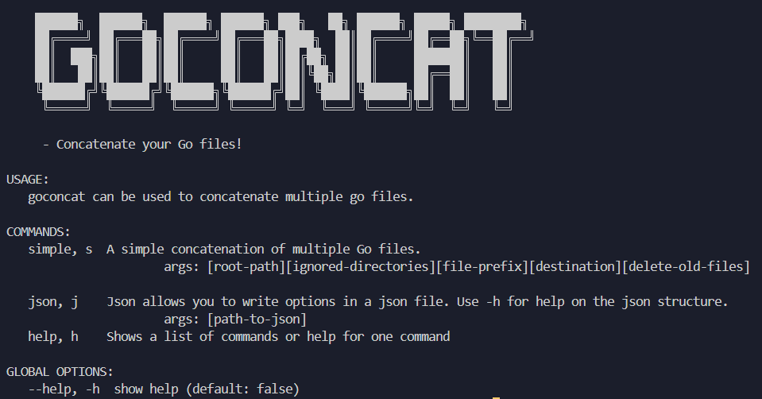

<div align="center">



</div>

<p align="center">
    
</p>

<p align="center">
    <a href="http://godoc.org/github.com/adavila0703/goconcat">
        
    </a>
    <a href="https://app.codecov.io/gh/adavila0703/goconcat">
        
    </a>
    <a href="https://goreportcard.com/report/github.com/adavila0703/goconcat">
        
    </a>
</p>

> A general purpose file concatenation tool for Go. Use the CLI tool or add the package in your personal projects!

## Installation

```shell
go get github.com/adavila0703/goconcat
```

## CLI tool

```shell
go install github.com/adavila0703/goconcat@latest
```

## Usage

If you deicide to use a JSON file for your options, follow optionsExample.json

### JSON example

```json
{
  "rootPath": ".",
  "ignoredDirectories": ["dir1", "dir2"],
  "filePrefix": ["mocks_", "mock_"],
  "destination": "newdir",
  "deleteOldFiles": true,
  "splitFilesByPackage": false
}
```

```go
package main

import "github.com/adavila0703/goconcat"

func main() {
    options := goconcat.NewOptions()
    options.SetJSONOptions("options.json")
    goconcat.GoConcat(options)
}
```

### Options

Alternatively, if you decide to not use JSON for options, you can set your options using the SetOptions() function.

```go
package main

import "github.com/adavila0703/goconcat"

func main() {
	options := NewOptions()
	options.SetOptions(
		".",
		nil,
		[]PrefixType{"test_"},
		".",
		true,
		false,
	)
    goconcat.GoConcat(options)
}
```

### Functions

You can also skip the use of options and concatenate files manually.

```go
package main

import (
	"log"

	"github.com/adavila0703/goconcat"
)

func main() {
	filePaths := []string{"test/file_one.go", "test/file_two.go"}

	files, fileSet, err := goconcat.ParseASTFiles(filePaths)
	if err != nil {
		log.Fatal(err)
	}

	file, err := goconcat.ConcatFiles(files, fileSet, nil)
	if err != nil {
		log.Fatal(err)
	}

	newFilePath := "test/file_one_two.go"

	goconcat.WriteASTFile(file, fileSet, newFilePath)
}
```

## Options

| Option              | JSON                | JSON Type | Go Type      | Required | Description                                                                                                                                                                                         | Example                                |
| ------------------- | ------------------- | --------- | ------------ | -------- | --------------------------------------------------------------------------------------------------------------------------------------------------------------------------------------------------- | -------------------------------------- |
| RootPath            | rootPath            | string    | string       | yes      | Path where GoConcat will focus on.                                                                                                                                                                  | "rootPath": "."                        |
| IgnoredDirectories  | ignoredDirectories  | array     | []Directory  | no       | Directories which GoConcat will ignore.                                                                                                                                                             | "ignoredDirectories": ["dir1", "dir2"] |
| FilePrefix          | filePrefix          | array     | []PrefixType | no       | GoConcat will only parse files with the given prefix.                                                                                                                                               | "filePrefix": ["mocks_", "mock_"]      |
| Destination         | destination         | string    | string       | no       | Destination file where GoConat will write the concatenated files. If no destination is given or if the root path is given GoConcat will default the directory, file name and package to "goconcat". | "destination": "newdir"                |
| DeleteOldFiles      | deleteOldFiles      | bool      | bool         | no       | Specify if you would like the original files to be deleted.                                                                                                                                         | "deleteOldFiles": true                 |
| SplitFilesByPackage | splitFilesByPackage | bool      | bool         | no       | If set to true, only the packages will be concatenated and saved to the new destination with their original package name as the file name.                                                          | "splitFilesByPackage": false           |
